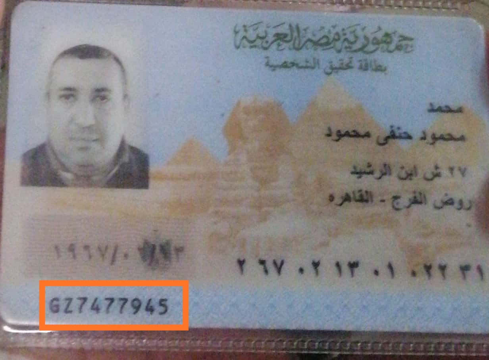
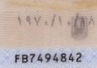
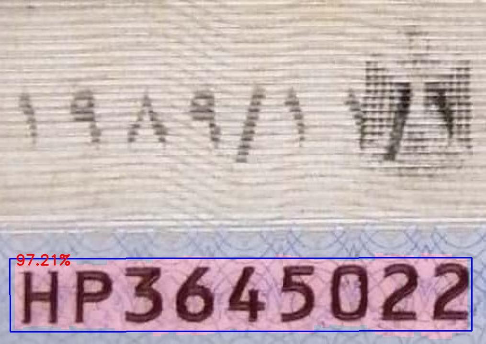

## Indentify unique ID from Egyptian National ID Cards
> A pure pytorch implemented ocr project.
Text detection is based CTPN and text recognition is based CRNN.  

## Prerequisite

- python-3.5+
- pytorch-0.4.1+
- torchvision-0.2.1
- opencv-3.4.0.14
- numpy-1.14.3

### Preprocessing
To detect the unique ID from the image we need to find ROI from an Image.
This can be done by writing simple script to crop an image.

### ROI
Crop an image using img_crop.ipynb

### Detection
Detection is based on [CTPN]

### Recognition
Recognition is based on [CRNN]

### Run the Code

>python3 demo.ipynb

The image files in ./test_images will be tested for text detection and recognition, the results will be stored in ./test_result.

If you want to test a single image, run
>python3 test_one.ipynb [filename]

